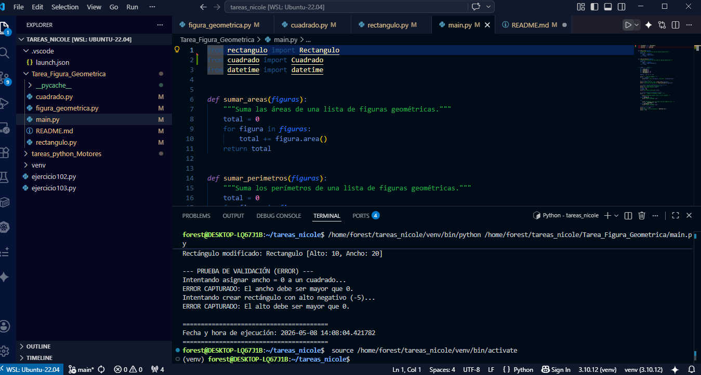

#### Estudiante: Nicole Samara Chaguay Alejandro.
#### Curso: GIG-S-NO-3-4
#### Materia: Programación Orientada a Objetos. 
#### Docente: Jose Cordova Aragundi.

# Taller POO: Figuras Geométricas

## Descripción del Ejercicio
En este taller se pone en practica la creación de figuras geométricas (Cuadrados y Rectángulos) aplicando los pilares de la Programación Orientada a Objetos en Python. Se enfoca en el control estricto de datos mediante propiedades y la reutilización de código a través de la herencia.

## Clases Implementadas
- **FiguraGeometrica**: Clase base (abstracta) que encapsula **alto** y **ancho**. Incluye validaciones para asegurar que las dimensiones sean siempre positivas.
- **Cuadrado**: Especialización de la base que obliga a que ambos lados sean iguales desde el constructor. Sobrescribe el cálculo de perímetro.
- **Rectangulo**: Extensión de la base para figuras con lados potencialmente desiguales. Sobrescribe el cálculo de perímetro.

## Conceptos de POO Aplicados
1. **Encapsulamiento**: Uso de **_** atributo privado y decoradores como  **@property**.
2. **Herencia**: Las subclases heredan la lógica de validación y el cálculo de área.
3. **Polimorfismo**: Las funciones **sumar_areas** y **sumar_perimetros** procesan cualquier objeto derivado de la base sin importar su tipo específico.

## Evidencia de Ejecución

